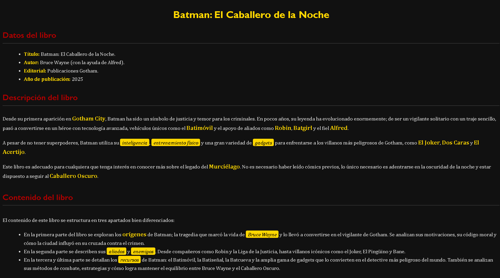

# CSS - Ejercicio (4)

A partir de la imagen que se te proporciona, debes incluir un documento `CSS`, para crear un documento `HTML` que tenga el mismo aspecto a la siguiente imagen:

- Tienes que tener en cuenta los siguientes requisitos:

### El texto principal:

1. El color del texto es gris claro: `#ddd`.
2. El color de fondo es Gotham night: `#111`.
3. El tipo de letra es: `Cambria`.
4. El tamaño del texto: `16px`.
5. Espacio entre lineas: `1.6`.

### El encabezado de nivel 1 `h1`:

1. El color del texto es amarillo bat-señal: `#FFD700`.
2. El tipo de letra es: `Calibri`.
3. El tamaño del texto: `30px`.
4. Texto centrado.

### El encabezado de nivel 2, 3, 4 `h2, h3, h4`:

1. El color del texto es rojo claro: `#A00`.
2. El tipo de letra es: `Calibri`.
3. El tamaño del texto: `24px`.
4. Borde de inferior: `#333 solido y de 2px`.
5. Relleno de inferior: `3px`

El color de los campos de los datos del libro es amarillo, negrita y en la misma linea: `#060 font-weight, display`.

El texto *Gotham City*, *Batimóvil*, *Robin*, *Batgirl*, *Alfred*, *El joker*, *Dos Caras*, *El acertijo*, *Murciélago*, *Caballero Oscuro* y *Orígenes*:

1. El tamaño del texto: `18px`.
2. El color del texto es rojo claro: `#FFD700`.
2. Texto en negrita *font-weight*.

El texto *inteligencia*, *entrenamiento físico*, *gadgets*, *Bruce Wayne*, *aliados*, *enemigos* y *recursos*:

1. El color del texto es blanco: `#000`.
2. El color de fondo del texto es negro: `#FFD700`.
3. Texto en italic *font-family*.
4. Relleno de izquierda y derecha: `6px`.
5. Relleno de superior y inferior: `2px`.
6. Bordes redondeados de: `4px`.

*Ayuda*:
- Propiedades que necesitaras utilizar.

`color` - Color de fuente. 

 

`background-color` - color de fondo.

 

`font-family` - estilo de fuente.

 

`font-size` - tamaño de la fuente.

 

`line-height` - espaciado entre lineas.

 

`text-align` - alineación del texto.

 

`border-radius` - redondea los bordes.

